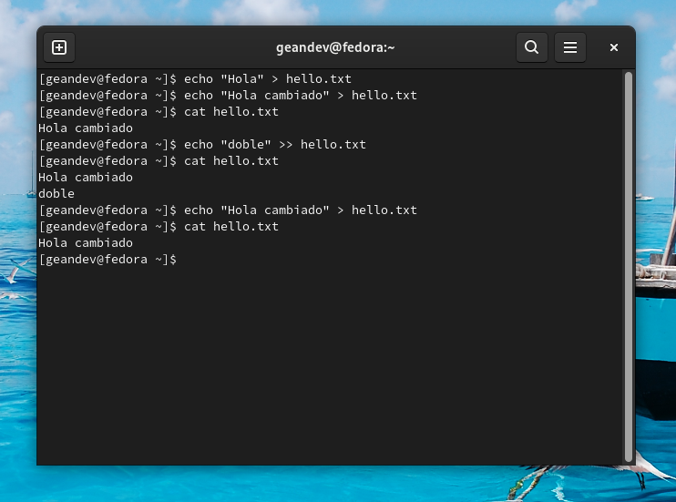
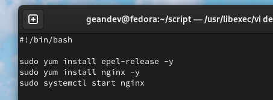
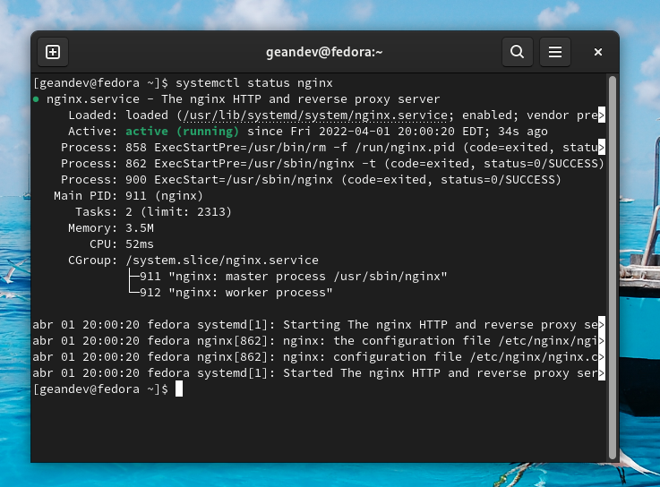

<h1 align="center">Apuntes Linux</h1>

<h2 align="center">Comandos</h2>

<b>cat </b> (leer y crear archivos)  
<b>mkdir</b> (crea fichero)  
<b>rmdir</b> (eliminar fichero)   
<b>cd</b> (moverse)  
<b>vi</b> (Crear archivo)  
<b>rm</b> (remover)  
<b>rm -r</b> (borrar directorio )  
<b>rm -rf</b> (borrar directorio forzado)  
<b>alias [comando]</b> (Abreviar comando)  
<b>history</b> (historial de comandos)  
<b>mv [nombrearchivo] [nuevonombrearchivo]</b> (Cambia el nombre de archivo/carpeta)  
<b>mv [nombrearchivo] [nombrecarpeta/]</b> (Mueve el archivo a carpeta)  
<b>Recuperar contraseña:</b> (Cuando se entre y se permita seleccionar el sistema operativo o al de rescate se mueven las teclas para que no entre automaticamente al sistema operativo, posteriormente se presiona la tecla e, se para en la linea de linux, se avanza hasta el final y se cambia rhgb quiet por rd.break, posteriomente se oprime control x para guardar y continuar. Este paso me permite acceder a una consola y se presiona la tecla enter. Se realiza el comando mount para revisar las unidades que estan montadas, allí se busca la unidad sysroot. Se ejecuta el comando mount -o rw,remount /sysroot/ y se presiona enter. Se accede al directorio del root con el comando chroot /sysroot/ y se oprime enter. Para establecer las contraseñas se oprime el comando passwd se presiona enter y posterior a eso permite cambiar la contraseña. PAra que tome los cambios se utiliza el comando touch /.autorelabel, para salir de la terminal se presiona exit y luego exit de nuevo. Una vez reiniciado el pc se oprime en el incio de sesion iniciar con otra cuenta y se escribe root y la contraseña nueva.)  
<b>Editar archivo: </b>(control i para editar, una vez terminado el texto se presiona escape y se pone :qw y enter)  
<b>cat [nombreArchivo] :</b> se puede instalar nano, para leer less [nombreArchivo]  
<b>man ls :</b> para cambiar el nombre de un archivo o carpeta   
<b>mv [nombreArchivo] [nuevoNombre]</b> Comando para mover un archivo o carpeta   
<b>mv [nombreArchivo] [rutaDondeSeVaAMover]</b>  
<b>tar</b>(Sirve para comprimir y descomprimir archivos y directorios)   
<b>tar -cvf [nombrearchivo].tar /home/... </b> (-c: crear comprimido, -v: verbose, log, observar comportamiento, -f:el nombre del comprimido)   
<b>tar -xvf [nombrearchivo].tar </b> (-x: descomprimido, -v: verbose, log, observar comportamiento, -f:el nombre del comprimido)   
<b>tar -xvf [nombrearchivo].tar -c /home/.. </b>(para descomprimir en alguna ruta)   
<b>tar -tvf [nombrearchivo].tar</b>(listar)   
<b>tar -xvf [nombrearchivo] "file1"  "file2"</b> (Descomprimir multiples archivos)  
<b>tar -cf [nombrearchivo] bar foo</b> (Comprimir multiples archivos)  
<b>df -Th</b> (Permite saber el tamaño de los discos y particiones)  
<b>du -sh</b> (Permite saber el tamaño de los archivos)   
<b>zip [nombrenuevo].zip nombreexiste</b> (Sirve para comprimir archivos y directorios)   
<b>unzip [nombreexiste].zip</b> (Sirve descomprimir archivos y directorios)  
<b>df -Th</b> (Mirar el almacenamiento de las particiones)   
<b>uptime</b> (tiempo encendido)  
<h2>PERMISOS DE USUARIO , GRUPO U OTROS</h2>   
<b>
User: r:read(4),
w:write(2),
x:execute(1)
</b>   
<b>chmod ### [archivo o directorio]</b>(Permiso de usuario,grupo u otro)   
<b>chmod u+r,u+w,u+x</b> (Darle permiso de rwx al usuario)   
<b>chmod u=rwx</b>   

<h2><strong>Permisos</strong></h2>

Lectura: r = 4  
Escritura: w = 2  
Ejecución: x = 1  

Grupos  
Pueden tener diferentes permisos de acuerdo a cada grupo  
User: rwx = 421 = 7  
Group: rwx = 421 = 7  
Others: rwx = 421 = 7  

Para dar permisos a un directorio se toma el el total de cada grupo  
Por ejemplo, para darle todos los permisos a un archivo seria = 777

Para asignar el permiso se utiliza el comando <strong>chmod 777 [archivo o directorio]</strong>

Comando para agregar usuario: <strong>adduser [nombreUsuario]</strong>  
Comando para añadir contraseña al usuario: <strong>passwd [nombreUsuario]</strong>  
Comando para quitarle los archivos a un usuario: <strong>chown [usuario][usuario] [archivos o directorios]</strong>  
Comando para crear un comando sin bash o sin acceso al sistema: useradd [nombreUsuario] -s /sbin/nologin   
Comando para darle otra vez permisos al usuario: usermod [nombreUsuario] -s /bin/bash   
Comando para eliminar un usuario: userdel [nombreUsuario] v
Comando para crear grupo: groupadd [nombreGrupo] v
Comando para ver los grupos: cat /etc/group   
<b>top</b>  para mirar los procesos que esta corriendo en el servidor, es mas administrativo  
<b>yum install httpd</b> Instalar servidor web  
<b>systemctl start,restart,enable,stop</b> permite depeniendo la bandera ya sea la ejecucion, restart...   
<b>ps</b> para ver los procesos que se estan ejecutando en nuestro sistema  
<b>kill -9 </b> Esta bandera sirve para matar de forma adecuada un proceso `(PREGUNTA DE PARCIAL)`  
<b>df -h</b> Espacio en las particiones   
<b>xfs</b> Aumentar en caliente las particiones pero no disminuir  
<b>ext4</b> Aumentar las partiiones y dismunuir, pero no en caliente  
<b>du -sh [directorio]</b>   
<b>htop</b> (ver procesos con grafica)   
<b>jobs</b>control c: salir control z: mandar a segundo plano (Para ver procesos que se ejecutan en segundo plano)  
<b>fg %#procesos</b> para regresar el procesos detenido de sleep tiempo  
<b>nice -n [valor] [nombreproceso]</b> (valor menos es mas favorable y mas valor es menos favorable)  
<b>-g</b> grupo primario  
<b>-G</b> grupo secundario  
<h1> Redirecciones y tuberias</h1>
<b> `>` Cambia el contenido del archivo texto </b>   
<b> `>>` Agrega y mantiene el contenido anterior  </b>   
<b> 0: stdin  salida estandar
    1: stdout salida buena
    2: sterr  salida con error
    find / -type f -user geandev > todo.txt 2>&1
</b>       
  
<b> ps fea | grep ssh</b> la salida del comando ps lo envia a grep y filtra todo lo que tenga ssh   
<b>ps fea | grep ssh 2> ssh.txt</b>   
<h1>Scripts</h1>
<b>
#!/bin/bash  
- instruccion 1
- instruccion 2
- var param_1 = $1
- var param_2 = $2
- .....
- var param_10 = ${10}
</b>   
<b>vi [nombrescripts].sh (parametros)</b> Realiza todas las instrucciones que nosotros le digamos  
<b>chmod +x [nombrescript]</b>   
<b>mkdir script, cd script, vi deploy_web.sh, i, 
#!/bin/bash
  
luego ./deploy_web.sh Gean
  

</b>   
<b>usr/share/nginx/html</b>   

<h1>20 ABRIL 2022</h1>
<b>Firewall</b> (firewall-cmd --list-all)  
<b>DNS</b> (cat /etc/resolve.conf)  
<b>Gateway</b> (route -n)   
<b>Selinux</b>  (cat /etc/selinux)  
<b>route -n</b> sirve para verificar si un servidor tiene internet mediante el gateway (ping [ip])  
<b>cat /etc/selinux/config   </b>   
<b>getenforce</b> consultar el enforce actual   
<b>setenforce 0/1</b>  0:permisivo 1:enforcing  
<b>sudo firewall-cmd --zone=public ---permanent --add-port=3306/tcp</b>   

<h1>Crear particiones</h1>  
<b>lsblk
sudo su 
parted /dev/sda1 unit MB print free 
fdisk /dev/sdb 
n 
p 
1 
enter 
+2GB 
p 
w 
partprobe -s 
lsblk 
mkfs.ext3 /dev/sdb1 
mkdir /mnt/disconuevo 
mount /dev/sdb1 /mnt/disconuevo/ 
mount 
df -Th 
cd /mnt/disconuevo 
ls 
touch prueba 
echo "escribir" > prueba 
cat prueba 
cd .. 
vi /etc/fstab 
i 
/dev/sdb1 /mnt/disconuevo ext3 defaults 0 0 
esc 
:wq 
systemctl reboot 
</b>   
<b></b>   
<b></b>   
<b></b>   
<b></b>   
<b></b>   
<b></b>   
<b></b>   
<b></b>   

