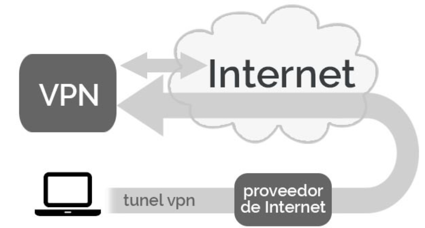

<h1 align="center">Que es y como instalar VPN</h1>

<h3 align="center">Que es VPN (Virtual Private Network)</h2>

Una conexión VPN lo que te permite es crear una red local sin necesidad que sus integrantes estén físicamente conectados entre sí, sino a través de Internet. Es el componente "virtual" del que hablábamos antes. Obtienes las ventajas de la red local (y alguna extra), con una mayor flexibilidad, pues la conexión es a través de Internet y puede por ejemplo ser de una punta del mundo a la otra.

Cuando te conectas a una conexión VPN, esto cambia. Todo tu tráfico de red sigue yendo desde tu dispositivo a tu proveedor de Internet, pero de ahí se dirige directo al servidor VPN, desde donde partirá al destino. Idealmente la conexión está cifrada, de modo que tu proveedor de Internet realmente no sabe a qué estás accediendo. A efectos prácticos, tu dirección IP es la del servidor VPN: en muchos aspectos es como si estuvieras físicamente ahí, conectándote a Internet.

<h3 align="center">Como instalar una VPN</h2>

Para instalar y activar un servidor VPN, siga estos pasos:

1.Haga clic en Inicio , elija Herramientas administrativas y, a continuación, haga clic en Enrutamiento y acceso remoto.

2.Haga clic en el icono del servidor que coincida con el nombre del servidor local en el panel izquierdo de la consola. Si el icono tiene un círculo rojo en la esquina inferior izquierda, no se ha activado el servicio de enrutamiento y acceso remoto. Si el icono tiene una flecha verde que apunta hacia arriba en la esquina inferior izquierda, se ha activado el servicio de enrutamiento y acceso remoto. Si el servicio de enrutamiento y acceso remoto estaba previamente en servicio, es posible que desee volver a configurar el servidor. Para volver a configurar el servidor:

3.Haga clic con el botón secundario en el objeto de servidor y, a continuación, haga clic en Deshabilitar enrutamiento y acceso remoto. Haga clic en Sí para continuar cuando se le pida un mensaje informativo.
Haga clic con el botón secundario en el icono del servidor y, a continuación, haga clic en Configurar y habilitar enrutamiento y acceso remoto para iniciar el Asistente para la configuración del servidor de enrutamiento y acceso remoto. Haga clic en Siguiente para continuar.
Haga clic en Acceso remoto (acceso telefónico o VPN) para activar equipos remotos para llamar o conectarse a esta red a través de Internet. Haga clic en Siguiente para continuar.
Haga clic para seleccionar VPN o Acceso telefónico local en función del rol que desee asignar a este servidor.

4.En la ventana Conexión VPN, haga clic en la interfaz de red que está conectada a Internet y, a continuación, haga clic en Siguiente.

5.En la ventana Asignación de direcciones IP, haga clic en Automáticamente si se usará un servidor DHCP para asignar direcciones a clientes remotos o haga clic en Desde un intervalo especificado de direcciones si solo se debe dar una dirección de un grupo predefinido a los clientes remotos. En la mayoría de los casos, la opción DHCP es más sencilla de administrar. Sin embargo, si DHCP no está disponible, debe especificar un intervalo de direcciones estáticas. Haga clic en Siguiente para continuar.

6.Si ha hecho clic en Desde un intervalo de direcciones especificado, se abrirá el cuadro de diálogo Asignación de intervalo de direcciones. Haga clic en Nuevo. Escriba la primera dirección IP en el intervalo de direcciones que desea usar en el cuadro Iniciar dirección IP. Escriba la última dirección IP del intervalo en el cuadro Dirección IP final. Windows calcula automáticamente el número de direcciones. Haga clic en Aceptar para volver a la ventana Asignación de intervalo de direcciones. Haga clic en Siguiente para continuar.

7.Acepte la configuración predeterminada de No, use Enrutamiento y acceso remoto para autenticar las solicitudes de conexión y, a continuación, haga clic en Siguiente para continuar. Haga clic en Finalizar para activar el servicio de enrutamiento y acceso remoto y configurar el servidor como servidor de acceso remoto.