<h1 align="center">Taller III (Linux 1)</h1>
_Gean Carlo Cortes Mayorga 11-03-2022_

<h2 align="center"> 1. Comprimir el directorio Bisabuelo y Bisabuela </h2>

Para comprimir cada uno de los directorios usamos el comando 
`tar -cvf nombrenuevo.tar nombredirectorio`

<h2 align="center"> 2. Comprimir el directorio Bisabuelo y Bisabuela en formato tar.gz y bz2</h2>

Para comprimir cada uno de los directorios usamos el comando 
`tar -cvf nombrenuevo.tar.gz nombredirectorio`

tar.gz:

bz2:

<h2 align="center"> 3. Listar los archivos comprimidos</h2>

Para listar cada uno de los directorios comprimidos usamos el comando `tar -tvf nombrearchivo.{formato}`

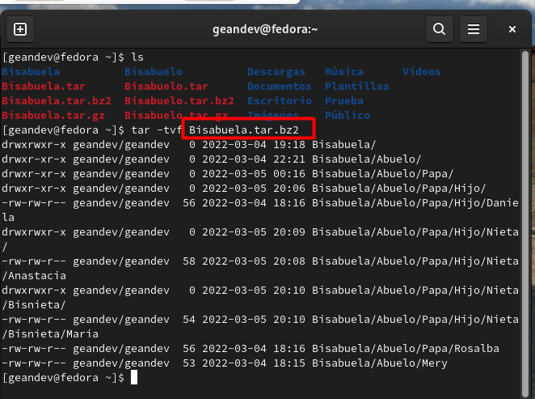

<h2 align="center"> 4. Descomprimir los directorios /Bisabuelo en las siguientes rutas: </h2>

Para descomprimir cada uno de los directorios usamos el comando `tar -xvf nombrenuevo.{formato} -C  ../../..`

`/tmp`
Ejemplo con Bisabuelo.tar ../../tmp/ (estando en /home/geandev)

Ahora con los otros
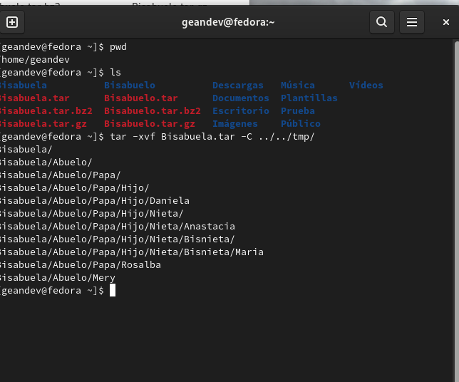
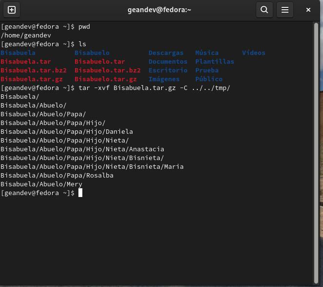
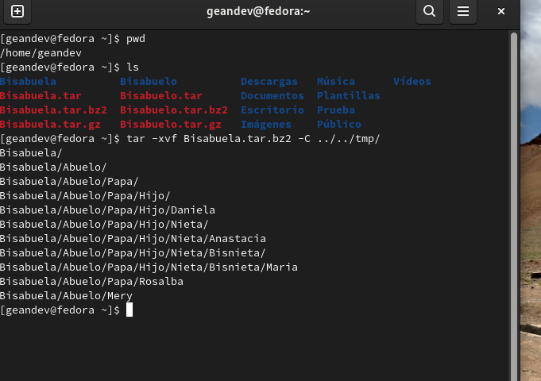
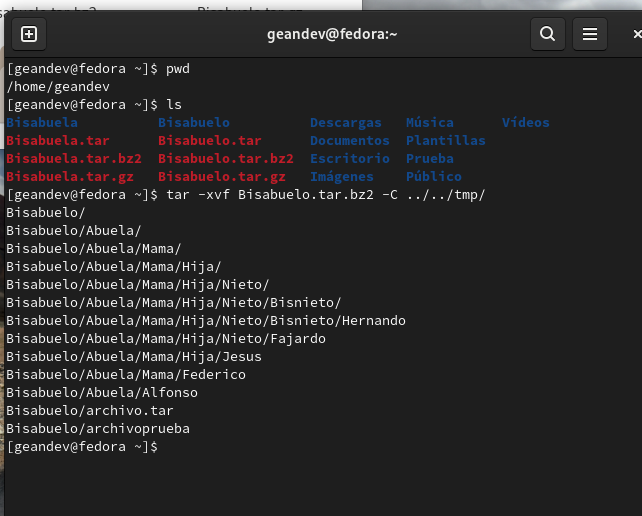
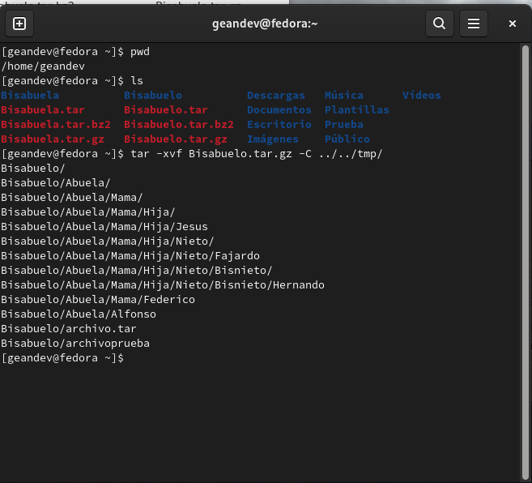

`/root`
Ejemplo con Bisabuelo.tar ../../root/ (estando en /home/geandev)

Ahora con los otros
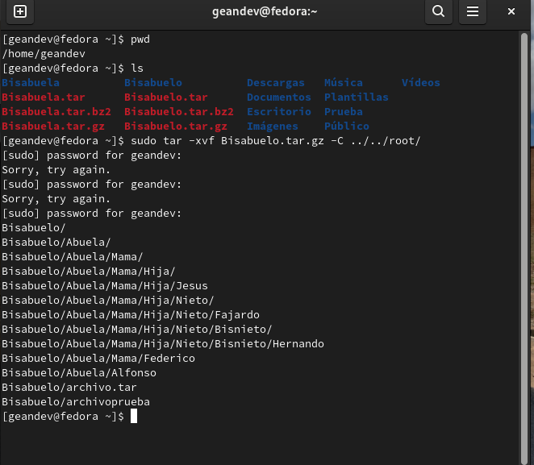
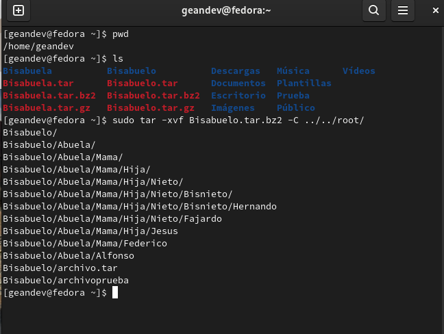
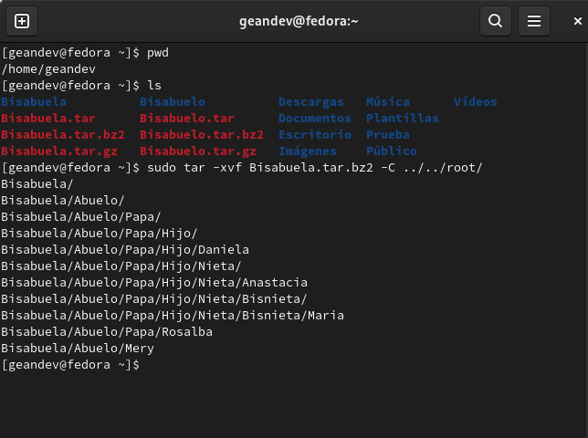
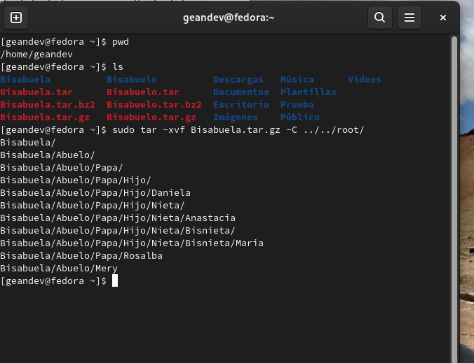
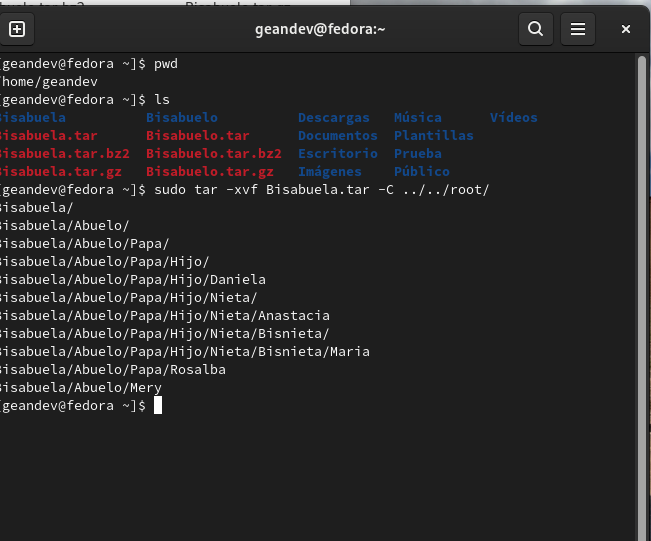

Finalmente miramos en cada ruta que si se descomprimieron los archivos
/tmp:
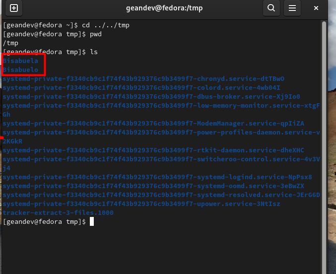

/root:
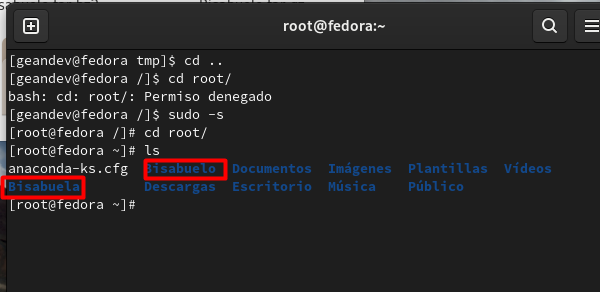

<h2 align="center"> 5. Comprimir los directorios usando la herramienta o paquete (zip, unzip)</h2>

Inicialmente debemos haber installado el paquete de zip con el comando `sudo apt install zip`

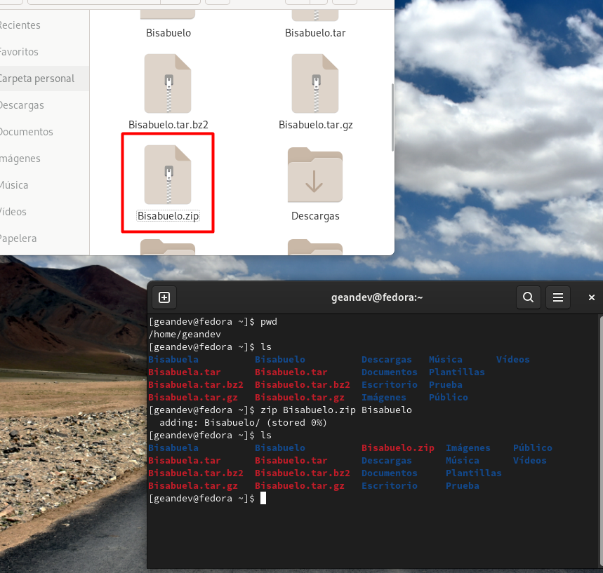
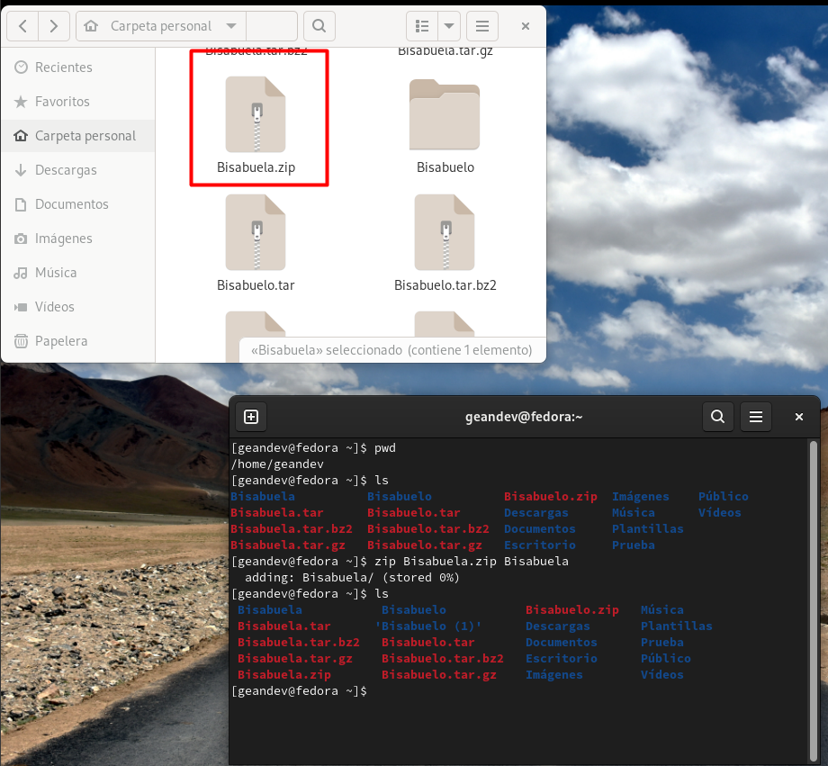

<h2 align="center"> 6. Reto: Realizar un script en bash shell que haga la copia de seguridad del directorio /etc. A las 24h todos los dias.</h2>

