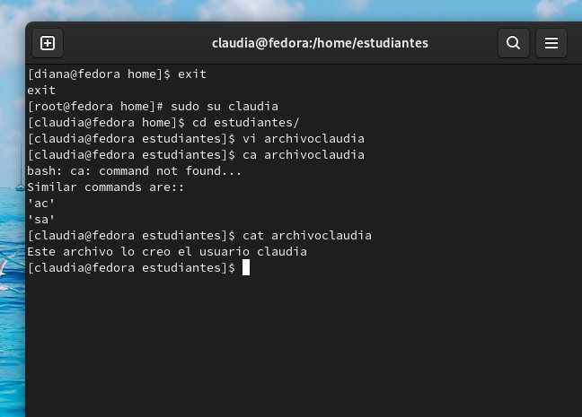

<h1 align="center">Taller IV (Linux 1)</h1>
_Gean Carlo Cortes Mayorga 18-03-2022_

<h2 align="center"> 1. Crear dos grupos llamados: profesor, estudiante </h2>

Para crear los grupos haremos uso del comando `groupadd` seguido de la opcion -r (crear una cuenta del sistema)   

<h2 align="center"> 2. Crear tres usuarios llamados: diana, claudia y laura</h2>

Para crear usuarios se usa el comando `useradd` [nombre_usuario]   

<h2 align="center"> 3. Conociendo que: diana es un profesor; laura es una estudiante y
claudia es un profesor y un estudiante.
Adicione todos los usuarios a los grupos correspondientes.</h2>

Para añádir un usuario a un grupo utilizamos el comando `usermod` y algunas banderas, la bandera -g (se usa en solitario si se desea cambiar el grupo del usuario) y -a (cuando se desea agregar un grupo al usuario)   

<h2 align="center"> 4. Cree dos directorios, uno para profesores (solo los profesores tienen acceso) y otro para
estudiantes (profesores y estudiantes tienen acceso). Asegúrese de asignar los permisos.</h2>

Primero creamos los directorios con el comando mkdir `[nombre_carpeta]`

  
Ahora vamos a asignar a la carpeta profesores y estudiantes que claudia sea el dueño, pero ademas vamos a cambiar los permisos para que usuario y grupo dentro del mismo contexto puedan read,write and execute (rwx)

usamos `chmod ugo{+,-}rwx` [directorio/archivo]

  

<h2 align="center"> 5. Verifique los permisos anteriores, usando las cuentas de los usuarios ya creados</h2>

Primero se crea un archivo txt para el cual vamos a comprobar los permisos antes hechos.

Primero probaremos con diana modificando el archivo de pruebaprofesores en el directorio profesores

Como se puede evidenciar la lectura, la escritura y la ejecucion para este usuario.

Ahora probaremos con Diana(Profesor)

y por ultima verificaremos a laura(estudiante)

Podemos ver que tiene el acceso restringido al ingreso de la carpeta profesores ya que es una estudiante 

<h2 align="center"> 6. Use un editor de texto para crear archivos en los respectivos directorios, usando
diferentes usuarios.</h2>

Empecemos con Diana

Luego con claudia

Luego con Laura

<h2 align="center"> 7. Como super usuario, cambie de dueño los archivos creados (como ejercicio).</h2>

usamos `chown user:'group'` [archivo]
Cambiamos el archivo de diana a claudia

y ahora vamos a cambiar el de laura a claudia y el de claudia a laura

<h2 align="center"> 8. Usando diferentes terminales, entre al sistema con los diferentes usuarios:
(equivoquese algunas veces por completo)</h2>

<h2 align="center"> 9. Usando diferentes terminales, entre al sistema con los diferentes usuarios:
(equivoquese algunas veces en las claves o en el nombre de usuario):</h2>

<h2 align="center"> 10. Determine la cantidad de veces que el estudiante laura ingreso al sistema.</h2>

<h2 align="center"> 11. Comprima el contenidos del directorio de los profesores en profesores.tgz y
el contenido del directorio de los estudiante en un archivo estudiantes.zip</h2>

profesores:

estudiantes:

<h2 align="center"> 12. Cree un alias para cambiar la clave del usuario diana.</h2>

Creamos el alias de las siguiente manera alias [nombre_alias]="comando" para el caso actual:

y como podemos observar nos pide la nueva contraseña

