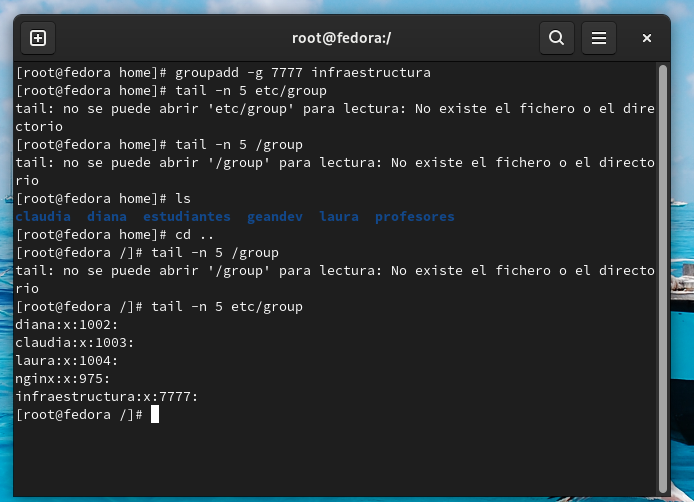
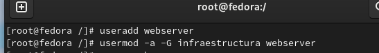
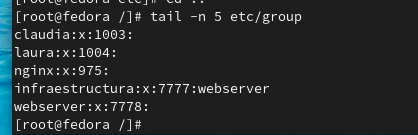
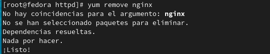
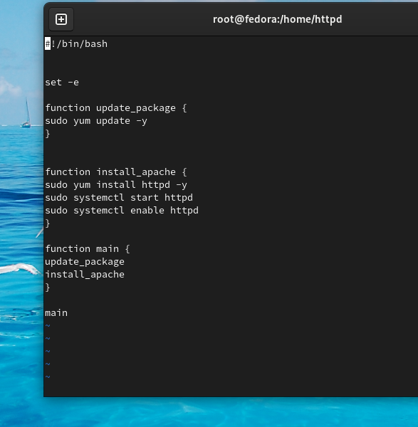
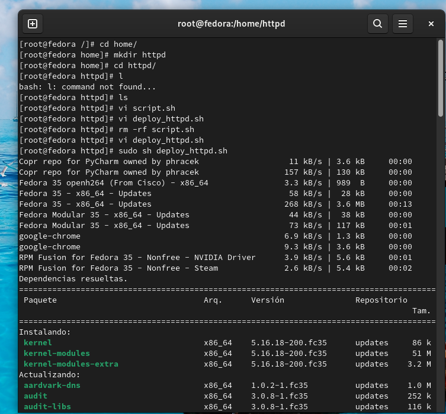
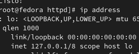
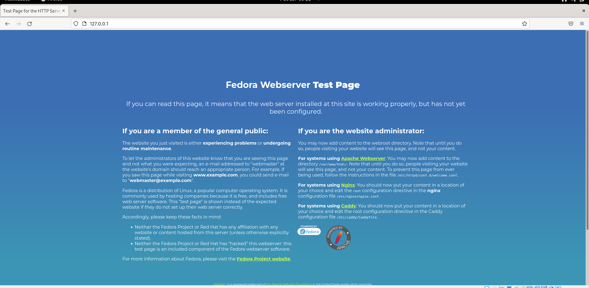

<h1 align="center">Taller VI (Linux 1)</h1>
_Gean Carlo Cortes Mayorga 06-04-2022_

<h2 align="center"> 1. Crear un grupo llamado, infraestructura con gid 7777</h2>

Ejecutamos el comando "groupadd -g 7777 infraestructura"

<h2 align="center"> 2. Crear un usuario llamada, webserver que pertenezca al grupo  </h2>

Ejecutamos el comando "useradd webserver" y luego lo agregamos al grupo infraestructura con el comando "usermod -a -G infraestructura webserver"

<h2 align="center"> 3. Detener el servicio nginx (Systemctl stop nginx) </h2>

En este caso por problemas de cache se tuvo que eliminar el servicio completo con "yum remove nginx"

<h2 align="center"> 4. Usar el Script anterior y cambiar el paquete nginx </h2>
 
Se crea el SH que contiene cada una de las funciones necesarios para el servidor httpd

Se ejecuta el sh con el comando "sh deploy_httpd"

verificamos ip, mediante el comando  "ip address"

y miramos el localhost si ya funciona el despliegue

