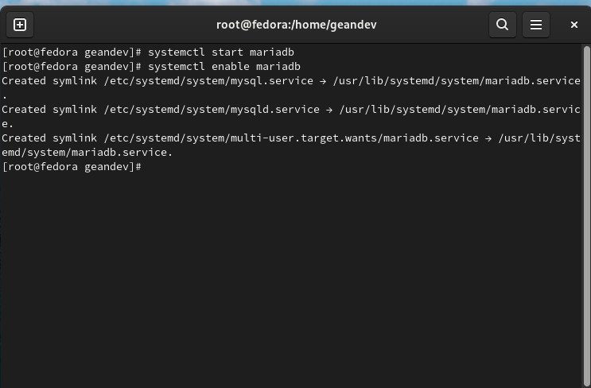
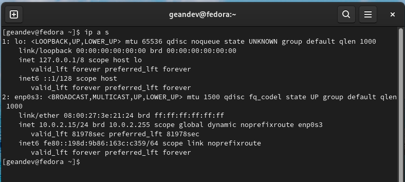

<h1 align="center">Taller VII (Linux 1)</h1>
_Gean Carlo Cortes Mayorga 22-04-2022_

<h2 align="center"> 1. Instalar Mysql en la maquina principal </h2>
Inicialmente debemos instalar en la maquina principal la base de datos de mariadb, usando el comando `sudo dnf install mariadb-server -y`

Luego vamos a iniciar el serviio de la base de datos mediante el comando `systemctl start mariadb` y luego la opcion enable para la persistencia `systemctl enable mariadb`

Ahora para comprobar lo anteriormente expuesto, verificamos mediante el comando 'systemctl status mariadb'

<h2 align="center"> 2. Test a conexion puerto 3306</h2>

Primero miramos la ip para hacer el test, mediante el comando `ìp a s`

La base de datos escucha conexiones a traves del puerto 3306 entonces intentamos conectarnos desde la maquina cliente a la maquina servidor por el puerto 3306 con el comando telnet [ip_address] [port_number]

Como se muestra anteriormente en la imagen, no ha sido posible la conexión, esto se debe a que en la maquina servidor deben realizarse dos configuraciones

1. Configurar maria-db para permitir conexiones remotas 
2. Abrir el puerto en el firewall

<h2 align="center"> 3. Configurar la maquina principal o servidor para que permita conexciones remotas</h2>

Primero configuramos la de bases de datos para permitir las conexiones remotas, para esto editamos el archivo de configuración y en el campo bind-address colocamos un valor de 0.0.0.0

Al realizar cambios en el archivo de configuracion de mariadb, debemos reiniciar el servicio con el comando `systemctl restart mariadb`

Ahora nos faltaria abrir el puerto 3306 en el firewall con el comando `sudo firewall-cmd --permanent --zone=public --add-port=3306/tcp`

<h2 align="center"> 4. Ahora probamos nuevamente la conexion al puerto 3306</h2>

<h2 align="center"> 5. Luego vamos a hacer una peticion mediante ssh</h2>

iniciamos el servicio si no se tiene arriba con el comando `systemctl start sshd` 

y mediante la otra maquina hacemos el `ssh [ip] -l [user]`

