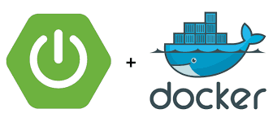

<h1 align="center">Taller IX (Linux 1)</h1>
_Gean Carlo Cortes Mayorga 22-04-2022_
 
  

<h1 align="center"> Kickstart Your Spring Boot Application Development </h1>
 
<h2 align="center">
</h2>
 

Docker simplifica y acelera sus flujos de trabajo al permitirle innovar libremente con su elección de herramientas, pilas de aplicaciones y entornos de implementación para cada proyecto. Puede ejecutar su artefacto Spring Boot directamente dentro de los contenedores de Docker. Esto es útil cuando necesita crear rápidamente microservicios

1. Se crea una aplicacion springboot convencionalmente, sin usar docker, teniendo en cuenta sus componentes principales.

2. El siguiente comando toma su código compilado y lo empaqueta en un formato distribuible, como un JAR: ./mvnw package

3. Luego se ejecuta el jar con el siguiente codigo: java -jar target/spring-boot-docker-0.0.1-SNAPSHOT.jar del jar anterior que se acabo de compilar, y es de esta forma que se puede acceder al mensaje inicial "Hello world"

<strong> Contenedorización de la aplicación Spring Boot </strong>

Docker lo ayuda a contener su aplicación Java, lo que le permite agrupar su aplicación Spring completa, el tiempo de ejecución, la configuración y las dependencias a nivel del sistema operativo. Esto incluye todo lo necesario para enviar una aplicación web multiplataforma y multiarquitectura

1. Se instala Docker Desktop para agilizar el proceso de creacion de imagenes, entre otras funcionalidades

2. Cree el siguiente Dockerfile vacío en su proyecto Spring Boot. "touch Dockerfile", se abre con su editor favorito y define la imagen base.

3. Se aprovecha la imagen de Docker  eclipse-temurin:17-jdk-focal disponible en Docker Hub "FROM eclipse-temurin:17-jdk-focal"

4. Se crea un directorio para albergar el codigo de aplicacion de nuestra imagen, WORKDIR /app

5. La siguiente instrucción COPY copia los envoltorios de Maven y el archivo pom de la máquina host a la imagen del contenedor, "COPY .mvn/ ./mvn" y  "COPY mvnw pom.xml ./"

6. El complemento Spring Boot Maven incluye un objetivo de ejecución que se puede usar para compilar y ejecutar su aplicación rápidamente. La última línea le dice a Docker que compile y ejecute sus paquetes de aplicaciones. "CMD ["./mvnw", "spring-boot:run"]"

<strong> Construyendo su imagen de Docker </strong> 

1. Ingrese el siguiente comando para iniciar este proceso, que produce una salida poco después: docker build --platform linux/amd64 -t spring-helloworld, o bien lo puede hacer desde la GUI de docker desktop

<strong> Ejecute su contenedor Spring Boot Docker </strong> 

Docker ejecuta procesos en contenedores aislados. Un contenedor es un proceso que se ejecuta en un host, que es local o remoto. Cuando un operador ejecuta docker run, el proceso del contenedor que se ejecuta se aísla con su propio sistema de archivos, red y árbol de procesos separado del host.

1. El siguiente comando de ejecución de la ventana acoplable primero crea una capa de contenedor grabable sobre la imagen especificada y luego la inicia: docker run -p 8080:8080 -t spring-helloworld

2. Mediante el docker desktop vaya a su dashboard y abra su aplicacion en su navegador.

3. En registros puede ver los comportamientos de su aplicacion.

4. Asi mismo tiene una ventana de estadisticas el cual le permite obervar el consumo de diferentes recursos.

<strong> Creación de aplicaciones Spring Boot de varios contenedores con Docker Compose </strong>

Para esta demostración, se aprovechará el popular repositorio de composición impresionante .

1. git clone https://github.com/docker/awesome-compose

El archivo de redacción define una aplicación con dos servicios: backend y db. Mientras implementa la aplicación, Docker Compose asigna el puerto 8080 del contenedor de servicios de backend al puerto 8080 del host, según su archivo. Asegúrese de que el puerto 8080 del host no esté en uso.

2. docker compose up -d, verificandolo con el comando "docker compose ps" listando sus contenedores ejecutados

3. Ademas puede verificar en su localhost:8080 

Y si desea detener o retirar sus contenedores:

4. docker compose down

