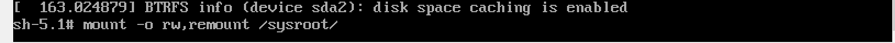
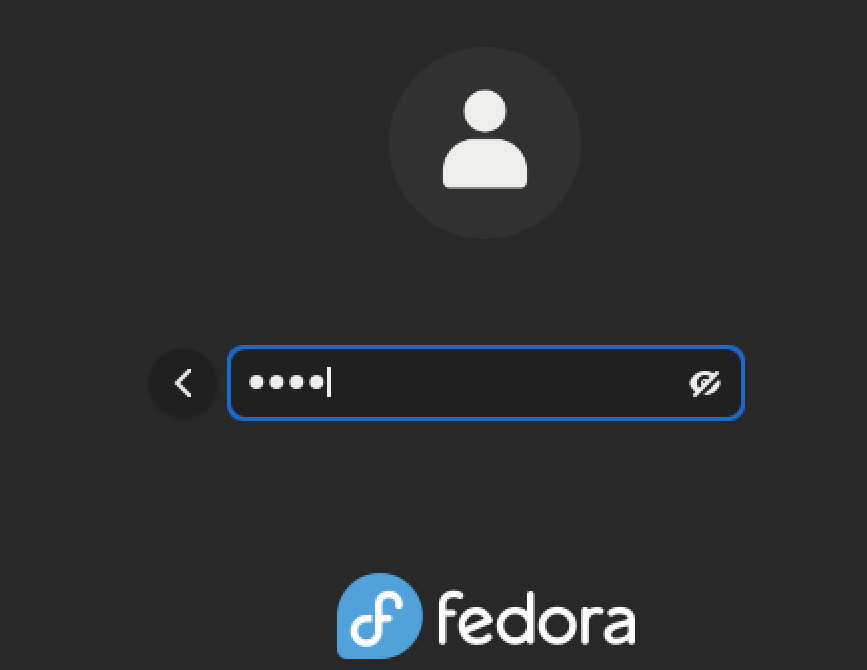
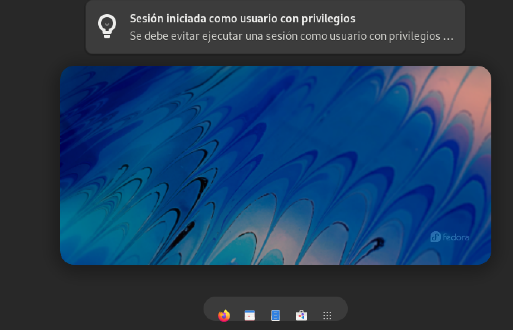

<h1 align="center">Taller II (Linux 1)</h1>
<b>_Gean Carlo Cortes Mayorga 25-02-2022_</b>

<h3 align="center"> 1. Recuperar la contraseña del usuario Root.</h3>

Inicialmente, cuando se inicia el sistema, presionamos la tecla `ESC` donde ingresaremos al sistema interno.

Luego reemplazamos la palabra `rhgb quiet` por `rd.break`

Presionamos enter y escribimos el comando `mount`

Luego, escribimos el comando `mount -o rw, remount /sysroot/`

Siguiendo el proceso, debemos escribir `chroot /sysroot` seguido de `passwd` para renovar la contraseña del usuario root

Luego presionamos `touch /.autorelabel`

Finalizamos usando el comando `exit` dos veces

Esperamos a que se reinicie el sistema e ingresamos con el usuario `root` y escribimos la contraseña propuesta en el proceso

Y finalmente podremos ingresar a la interfaz y sistema con los privilegios

---------------------------------------------------------------------------------------------------------------------------------------------------------------------------------------

<h3 align="center">2. Practicar el movimiento de archivos y directorios. Ademas renombrar archivos</h3>

