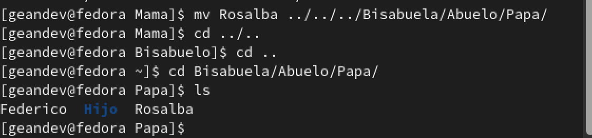
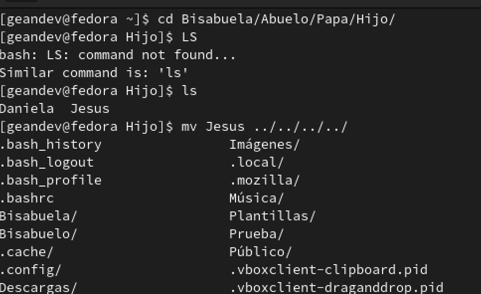

<h1 align="center">Taller II (Linux 1)</h1>
_Gean Carlo Cortes Mayorga 25-02-2022_

<h2 align="center"> 1. Recuperar la contraseña del usuario Root.</h2>

Inicialmente, cuando se inicia el sistema, presionamos la tecla `ESC` donde ingresaremos al sistema interno.

Luego reemplazamos la palabra `rhgb quiet` por `rd.break`

Presionamos enter y escribimos el comando `mount`

Luego, escribimos el comando `mount -o rw, remount /sysroot/`

Siguiendo el proceso, debemos escribir `chroot /sysroot` seguido de `passwd` para renovar la contraseña del usuario root

Luego presionamos `touch /.autorelabel`

Finalizamos usando el comando `exit` dos veces

Esperamos a que se reinicie el sistema e ingresamos con el usuario `root` y escribimos la contraseña propuesta en el proceso

Y finalmente podremos ingresar a la interfaz y sistema con los privilegios

---------------------------------------------------------------------------------------------------------------------------------------------------------------------------------------

<h2 align="center">2. Practicar el movimiento de archivos y directorios. Ademas renombrar archivos</h2>

Damos inicio creamos dos carpetas con los nombres de `Bisabuelo` y `Bisabuela`

Luego vamos a mover las carpetas `Abuelo`  a la carpeta `Bisabuela` y `Abuela` a la carpeta `Bisabuelo` 

Tenemos esta estructura

Posteriormente vamos a pasar los archivos que estan contenidos en cada una de las carpetas de `Bisabuelo` a `Bisabuela`respectivamente.

<!-- AQUI EMPIEZA LA PARTE DE BISABUELO A BISABUELA -->
<h2 align="center"> Bisabuelo --> Bisabuela </h2>

Abuela --> Abuelo

Empezamos buscando el archivo moviendonos con el comando `cd` y luego verificando que el archivo se escuentre con `ls`, posteriormente hacemos uso del comando `vm` para mover el archivo: 

Mama --> Papa

Empezamos buscando el archivo moviendonos con el comando `cd` y luego verificando que el archivo se escuentre con `ls`, posteriormente hacemos uso del comando `vm` para mover el archivo: 

Hija --> Hijo

Empezamos buscando el archivo moviendonos con el comando `cd` y luego verificando que el archivo se escuentre con `ls`, posteriormente hacemos uso del comando `vm` para mover el archivo: 

<!-- AQUI EMPIEZA LA PARTE DE BISABUELA A BISABUELO -->
<h2 align="center"> Bisabuela --> Bisabuelo </h2>

Abuelo --> Abuela

Empezamos buscando el archivo moviendonos con el comando `cd` y luego verificando que el archivo se escuentre con `ls`, posteriormente hacemos uso del comando `vm` para mover el archivo: 

Papa --> Mama

Empezamos buscando el archivo moviendonos con el comando `cd` y luego verificando que el archivo se escuentre con `ls`, posteriormente hacemos uso del comando `vm` para mover el archivo: 

Hijo --> Hija

Empezamos buscando el archivo moviendonos con el comando `cd` y luego verificando que el archivo se escuentre con `ls`, posteriormente hacemos uso del comando `vm` para mover el archivo: 

Finalmente podemos corroborar mediante el uso del comando `tree` el proceso que se acabo de realizar

El proximo proceso que se realizara sera el de crear dos carpetas `Nieto/Bisnieto` y `Nieta/Bisnieta` contenidas en cada carpeta de `Bisabuelo` y `Bisabuela` respectivamente

Empezamos creando la carpeta Nieto con el comando `mkdir`

Creamos el archivo con la informacion del Nieto con el comando `vi` y luego con `i` para editar, luego `ESC` : wq para guardar

Luego creando la carpeta Bisnieto con el comando `mkdir`

Creamos el archivo con la informacion del Bisnieto con el comando `vi` y luego con `i` para editar, luego `ESC` : wq para guardar

